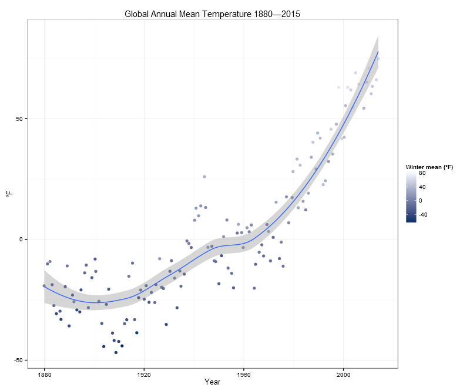

# datavisualization-001-HW1

class.coursera.org/datavisualization-001 :: Programming Assignment 1: Visualize Data Using a Chart

## It's Getting Hot

Source: [data.giss.nasa.gov/gistemp/](http://data.giss.nasa.gov/gistemp/tabledata_v3/GLB.Ts.txt)